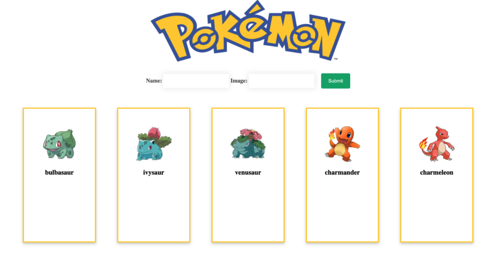
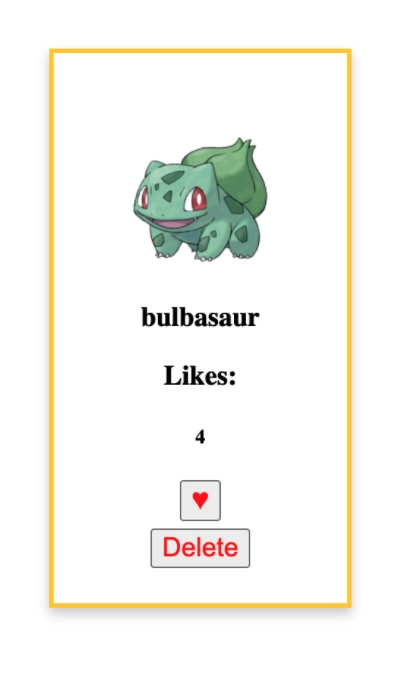

## DOM Manipulation and DOM Events

Agenda / Objectives:<br>
9:00-9:30am - Status Saturday - how are we feeling?? <br>
9:30-10:00am - Q&A of concepts we have covered so far <br>
10:00-10:15am - BREAK <br>
10:15pm-10:45 - review the DOM and discuss various DOM methods <br>
10:45-11:00 - BREAK <br>
11:00-12:00 - Begin our Pokemon group project, let's slap some stuff on the DOM together! <br>
12:00-1:00 - LUNCH
<br> <br>
1:00-2:00 - You will add some additional elements in small groups. We will come back and discuss our progress (and re-do this work together.) <br>
2:00 - 2:15pm - BREAK<br>
2:15-3:15pm - Discuss events and interacting with our elements to increase likes, etc.<br>
3:15-3:30 - BREAK<br>
3:30-4:00 - Continue Pokemon project to make it more dynamic. Hopefully we can finish this project but if not I'll send you home to finish it!

***

We will be reviewing these tools for manipulating the DOM for full CRUD!

- .querySelector()
- .querySelectorAll()
- .createElement()
- .getElementById()
- .getElementsByClassName()
- .append()
- .remove()
- .innerHTML
- .innerText,
- .textContent

.... and then!

<p align="center">
    
</p>

***

### Deliverables


1. Use the appropriate selector method to target and remove the h3 with id of ```welcome``` and also to target/remove the div with class of ```lecture-container```. 

2. Use the appropriate selector method to target the div with id of ```header``` and set its innerHTML = the following (note the different quotes wrapping the img tag, so we can avoid needing to escape our inner quotes.) You might need to play with white space/breaks to get this working: 
''

2. Define a function renderPokemon() (with a parameter of character) that will be responsible for generating the HTML for each pokemon card. We will a) create a div element and assign it an id of `poke-${character.id}`; b) create an img tag with appropriate src and alt attributes and c) create an h3 element with text content character.name.

***

## After Lunch Deliverables

<p align="center">
    
</p>

1. Create an "h3" element for each Pokemon and store the element in a variable 'pokeLikes'. Use textContent() to fill in the heading with the text "Likes: "

2. Create an "h5" element for each Pokemon and store the element in a variable 'likesNum'.
- Assign likesNum a className of "likes-num"
- Use .textContent to fill in the heading with the Pokemon character's number of likes

3. Create a "button" element for each Pokemon and store the element in a variable (likeBtn)
- Assign likeBtn a className of "like-btn"
- Use .textContent to fill in the button with: "♥"

4. Create a "button" element for each Pokemon and stores the element in a variable (deleteBtn)
- Assign deleteBtn a className of "delete-btn"
- Use .textContent to fill in the button with a label, "Delete"

5. Append all variables to "pokeCard"

### From here we will work together to make our elements interactive, using event listeners / event handlers. Get ready to have fun!!!


### Additional Resources
- [Defer Boolean Attribute For Our External JS Script Tags](https://www.w3schools.com/tags/att_defer.asp)