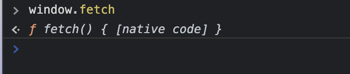
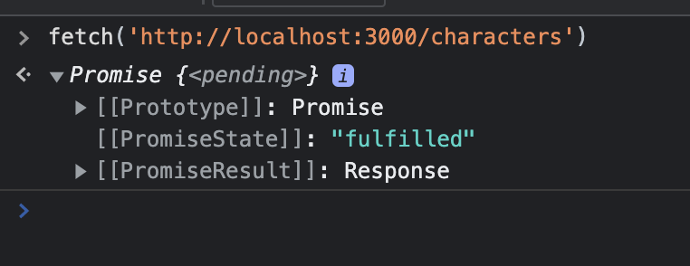

## Async Fetch

When we talk about the "request-response cycle" we are talking about client (aka browser)/server (aka ESPN or WaPo's computers) communication:

<p>
    
</p>

<br>
The browser uses http (Hyper Text Transfer Protocol) to communicate with the server to get the desired response. This protocol includes a valid URL and type of request (GET request is the default), as well as additional query parameters, as needed.

<br>

[Here is a full list of HTTP verbs from MDN](https://developer.mozilla.org/en-US/docs/Web/HTTP/Methods) but the main ones we will use are listed below. This gets us to "full CRUD" (Create, Read, Update, Delete) functionality:

<p>
    
</p>


Reference for status codes: [HTTP DOGS](https://httpstatusdogs.com/) or [HTTP CATS](https://http.cat/)

http://127.0.0.1/ === localhost

***

FULL URLS for today's fetches are http://localhost:3000/characters and http://localhost:3000/characters/:id
<br>
http://localhost:3000/characters => will return all characters that our server knows about
<br>
http://localhost:3000/characters/:id => will return the character whose id exactly matches the ```:id``` used within our fetch.
<br>

NOTE: ```:id``` is known as a *dynamic param* which will be replaced by the actual character's id via string interpolation. This protocol is provided to us via [REST](https://www.learnhowtoprogram.com/c-and-net/basic-web-applications/introduction-to-restful-routing) which we will learn more about as we continue into other Phases.

Our base url is: http://localhost:3000 <br>
Our endpoints are: ```/characters``` or ```/characters/:id``` <br> <br>


***

Asynchronous refers to tasks being done out of order. It looks as if the compiler can multi-task when in fact async functionality is handled by the browser (window) to allow the JS thread to be "non-blocking".
<p>
    
</p>

 Remember, the compiler reads the code from top to bottom. Feel free to place the following code in your dev tools console to see how synchronous code executes:
~~~
for(let i = 0; i < 50; i++) {
  console.log(i)
}

console.log("i am waiting.....")
~~~

Today we've created an API (Application Programming Interface) which is our db.json, fired up via [json-server](https://www.npmjs.com/package/json-server). <br>
***

## fetch anatomy

.fetch() => url is required when using fetch. url must be a string. <br>
fetch(url) => return of fetch method is going to be a Promise. Inside of that promise is going to be a response object.

<p>
    
</p>

We need ```.then``` to tell browser to *pause* until this promise is resolved.
.then returns ANOTHER promise (which requires a second .then to wait until that promise is resolved)!
<p>
    
</p>

So our full fetch looks like this:

~~~
fetch('urlGoesHere')
  .then(resp => resp.json())
  .then(returnedData => console.log(returnedData)))

~~~
**NOTE: We should always console.log our returned data to make sure the fetch was successful before moving forward.**

We put our fetch inside a function and then invoke that function which initializes our fetch process!

~~~
function getData(){
  fetch('http://randomurl.com')
  .then(resp => resp.json())
  .then(returnedArr => returnedArr.forEach(object => renderCards(object)))
}

(The last .then invokes our generic renderCards() for each returned object in our API. And the below invocation of our function jump starts our initialization.)

getData()
~~~