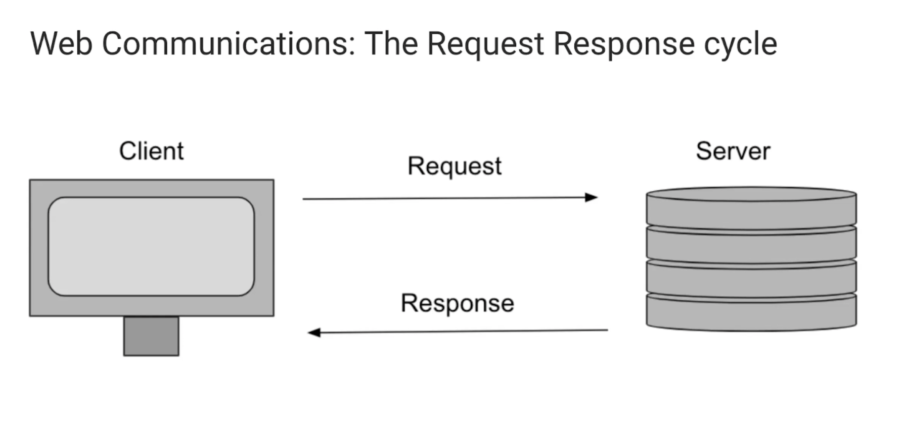
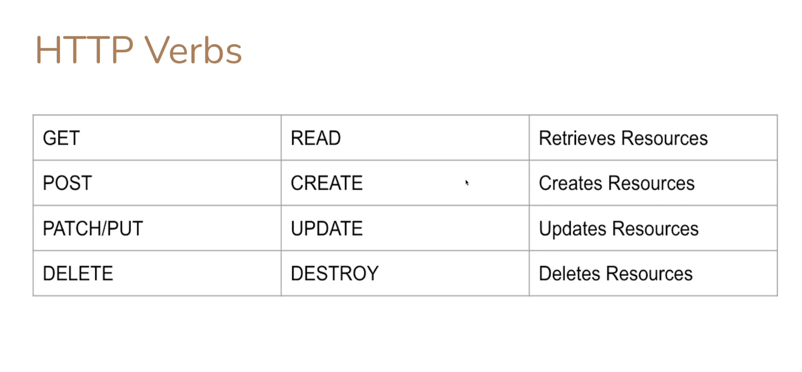

## Async Fetch

When we talk about request response we are talking about browser (aka client)/server communication:

    

We use http (Hyper Text Transfer Protocol) verbs to communicate with server to get the desired response

    

