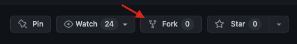
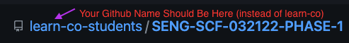
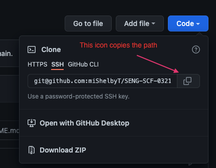
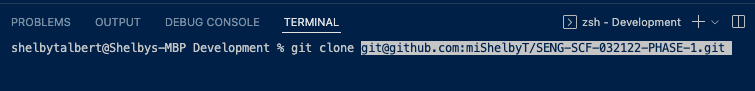
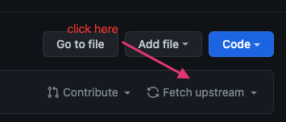
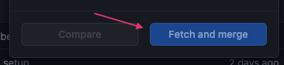

# SENG-SCF-032122-PHASE-1

### To pull this repo down to your computer: 

### 1. Click the fork icon 

### 2. Make certain that your name shows up instead of learn-co-students. This is how you'll know you've successfully forked the repo over to your own Github account. 

### 3. Click the big Code Button (yours might be green) to copy the SSH key/path that you will use to clone the repo onto your computer 

### 4. in your terminal, cd to where you want this directory to live. type `git clone` (+ that copied SSH key), and hit 'enter'

### 5. cd into that directory and you're there! 

*Note: If you successfully added `code` to your Shell commands when you set up your environment, you should be able to use the command `code` plus the file you're cd'ing into. Or if you've cd'ed in as a separate command, you can use `code .` to open the new file.*

then....

### 6. Go to your FORKED version of the repo and click Fetch upstream. Then click fetch and merge. This will sync your repo with the learn-co-students one (if and when there are updates for you).

### 7. Go into your VS Code. Make sure your terminal puts you into the outer directory called SCF-SENG-032122-phase-1 (not in an inner folder). 

*To avoid merge conflicts, make sure your index.js does not have new code. Any code there can be cut and pasted into studentNotes.js. You can use the `git restore <file path>` command to make sure you aren't adding/committing that file *

### 8. Add and commit all changes (i.e., `git add .` and `git commit -m "your message goes here"`) 

### 9. Go ahead and `git pull origin main` or `git pull --rebase` and you should be good to go! (You can `git push` after this step. At this point your Github repo will be 100% up to date with what is on your system.)